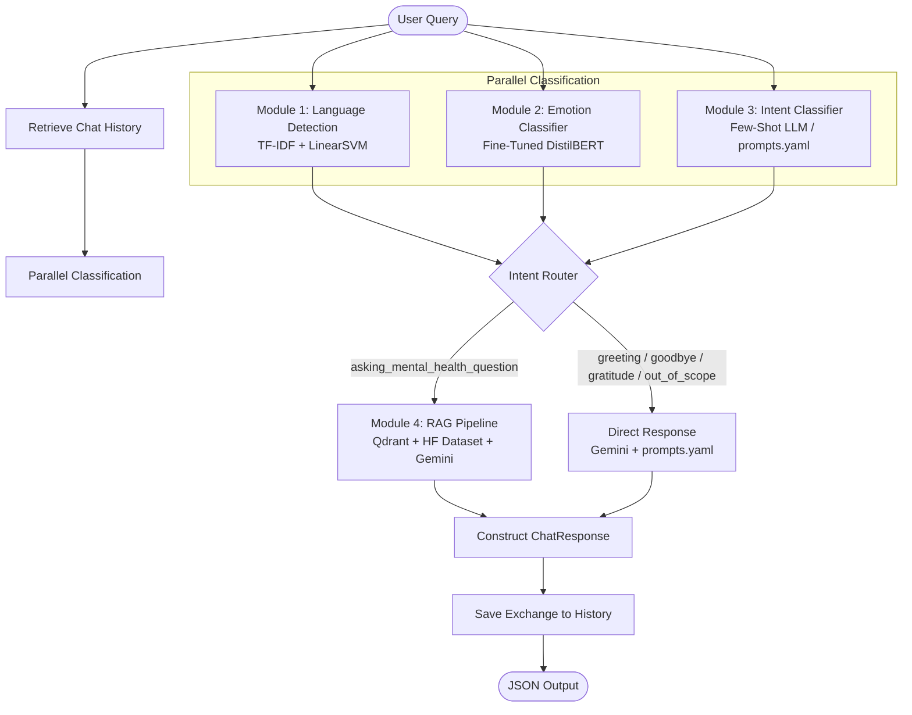

# RAG-Based Mental Health Support Chatbot

An empathetic, multi-lingual, and context-aware mental health support assistant built as a unified NLP pipeline. The chatbot combines advanced natural language processing (NLP) classification models, semantic search with retrieval-augmented generation (RAG), and a session-based history manager to provide secure, empathetic, and tailored guidance.

---

## 🏗️ System Architecture

The pipeline processes user queries sequentially, classifying language, emotion, and intent in parallel before routing the request to either the Q&A RAG pipeline or a direct prompt-based fallback:



---

## 📂 Project Structure

```
RAG-Based-Mental-Health-Support/
├── main.py                     # FastAPI entrypoint exposing the unified pipeline
├── schemas.py                  # Shared Pydantic data schemas & Enums (Intent, Emotion)
├── history_manager.py          # Session-based local JSON chat history (sliding window)
├── requirements.txt            # Project-wide Python dependencies
├── .env.example                # Template for environment configuration keys
│
├── language_detector/          # Module 1: Language Identification
│   ├── language_detector.py    # Detector script (public API & standalone CLI test)
│   ├── language_detector.joblib     # Pre-trained TF-IDF + SVM classifier pipeline
│   ├── language_detector_meta.joblib# Class labels metadata mapping
│   └── train_language_detection.ipynb  # Notebook for model training & evaluation
│
├── emotion_classifier/         # Module 2: Emotion Classifier
│   ├── predictor.py            # DistilBERT predictor class interface
│   ├── final_emotion_model/    # Hugging Face fine-tuned DistilBERT weights & config
│   └── DistilBertTuned_EmotionClassifier.ipynb # Notebook detailing the fine-tuning process
│
├── Intent_classifier/          # Module 3: Intent Identification
│   ├── intent_classifier.py    # Intent classifier & context-aware direct responder
│   ├── prompts.yaml            # YAML configuration for LLM instructions and examples
│   └── module3_intent_classifier.ipynb # Notebook exploring Groq/Gemini intent classify
│
└── module4_rag/                # Module 4: Q&A RAG Pipeline
    ├── rag_pipeline.py         # Knowledge-base search and context-grounded response pipeline
    ├── config.yaml             # Vector DB, Embedding Model, and LLM configuration
    ├── pipeline_config.json    # Pipeline metadata cache
    ├── README.md               # Dedicated RAG module documentation
    └── module4_rag.ipynb       # Step-by-step vector indexing & testing notebook
```

---

## 🚀 Getting Started

### Prerequisites
- Python 3.10+
- Virtual Environment (recommended)

### Step 1: Install Dependencies
Clone the repository and install the project requirements:
```bash
pip install -r requirements.txt
```

### Step 2: Set Up Environment Variables
Copy `.env.example` to `.env` and populate your API credentials:
```bash
cp .env.example .env
```
Update `.env` with the following variables:
- `GEMINI_API_KEY`: API key from Google AI Studio.
- `QDRANT_URL`: Endpoint for your Qdrant vector database.
- `QDRANT_API_KEY`: Authentication key for Qdrant.
- `GROQ_API_KEY`: API key for Groq (optional/fallback).
- `TOKENIZERS_PARALLELISM`: Set to `false` to avoid warning logs in multi-threaded workflows.
- `FRONTEND_ORIGIN`: Exact frontend origin for CORS. For GitHub Pages, use your site origin such as `https://your-username.github.io`.

If you need to allow more than one origin, set `FRONTEND_ORIGINS` to a comma-separated list.

### Step 3: Populate the Q&A Vector Database (Qdrant)
Run the indexing pipeline inside `module4_rag/module4_rag.ipynb` to download the Hugging Face dataset (`Amod/mental_health_counseling_conversations`), generate embeddings using `sentence-transformers/all-MiniLM-L6-v2`, and upload them to your Qdrant instance.

### Step 4: Run the FastAPI Server
Start the API server locally:
```bash
python main.py
```
*Note: The server runs at `http://localhost:8000`. You can access the interactive API docs (Swagger UI) at `http://localhost:8000/docs`.*

---

## 🔌 API Endpoints

### 1. Liveness & Health Check
* **Endpoint:** `GET /health`
* **Response:**
  ```json
  {
    "status": "ok",
    "module": "chat_pipeline",
    "version": "1.0.0"
  }
  ```

### 2. Feedback
* **Endpoint:** `POST /feedback`
* **Request Body:**
  ```json
  {
    "session_id": "user_session_999",
    "vote": "thumbs_up"
  }
  ```
* **Accepted votes:** `thumbs_up`, `thumbs_down`

### 3. Unified Chat Pipeline
* **Endpoint:** `POST /chat`
* **Request Body:**
  ```json
  {
    "session_id": "user_session_999",
    "message": "I have been feeling extremely overwhelmed and anxious this week."
  }
  ```
* **Response Body:**
  ```json
  {
    "language_code": "en",
    "emotion": "sadness",
    "intent": "asking_mental_health_question",
    "response": "Feeling overwhelmed and anxious can be an incredibly heavy burden to carry... Here are some grounding exercises...",
    "response_source": "rag"
  }
  ```

---

## 🧠 Core NLP Modules

### 🌐 Module 1: Language Detection
* **Model Type:** character-level TF-IDF n-grams + Linear Support Vector Machine (LinearSVM).
* **Trained On:** `papluca/language-identification` (dataset covering 20 languages).
* **Behavior:** Extracts ISO 639-1 language codes. Fallback defaults to `"en"` when input text is too short (<3 chars) or confidence is less than 50%.

### 🎭 Module 2: Emotion Classifier
* **Model Type:** Fine-tuned `DistilBERT` sequence classifier.
* **Location:** Stored locally in `emotion_classifier/final_emotion_model/`.
* **Output Labels:** `joy`, `sadness`, `anger`, `fear`, `love`, `surprise`. Falls back to `unknown` on exception.

### 🧭 Module 3: Intent Classifier
* **Model Type:** LLM-based few-shot classifier leveraging `gemini-3.5-flash` or Groq.
* **Configured Via:** `Intent_classifier/prompts.yaml`.
* **Classification categories:** `greeting`, `goodbye`, `gratitude`, `asking_mental_health_question`, and `out_of_scope`.
* **Routing logic:** Non-RAG intents bypass the search database and receive an immediate contextually tailored and empathetic reply mapping the detected emotion and language.

### 📚 Module 4: Q&A RAG Pipeline
* **Knowledge Source:** `Amod/mental_health_counseling_conversations` dataset.
* **Vector Store:** Qdrant Cloud.
* **Embeddings:** `all-MiniLM-L6-v2` (384-dimensional cosine similarity).
* **LLM Engine:** `gemini-3.5-flash`.
* **Behavior:** RAG fetches the top 5 counselling QA pairs, matches the user's input language, and drafts an empathetic, safe, and actionable response incorporating the chat history.

### 💾 History Manager
* **Implementation:** `history_manager.py` maintains conversation threads locally under `chat_sessions/` as JSON documents.
* **Sliding Window:** Limits context to the last `10` turns (user/assistant pairs) to preserve token constraints and model focus.

---

## ⚠️ Medical Disclaimer

This project is a final academic/research NLP task and is **not** a substitute for professional medical advice, diagnosis, or treatment. If you or someone you know is in crisis or distress, please reach out to a professional mental health provider or contact your local emergency response hotline immediately.
